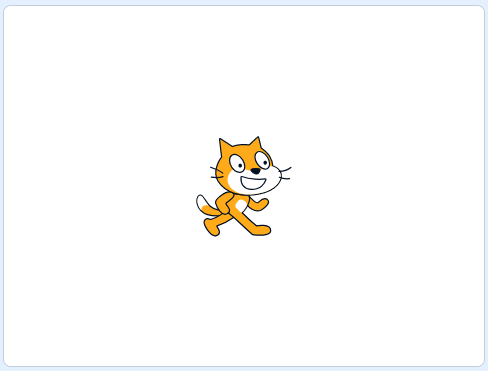

## Introduction

You are going to use Scratch to create an awesome thing.

This is an exemplar project.

### What you will make

--- no-print ---

Instructions on how to use the project.

https://scratch.mit.edu/projects/295547811/

  <iframe allowtransparency="true" width="485" height="402" src="//scratch.mit.edu/projects/embed/295547811/?autostart=false" frameborder="0" scrolling="no"></iframe>
  

--- /no-print ---

--- print-only ---

--- /print-only ---

--- collapse ---

---
title: What you will need
---

### Hardware

+ A computer capable of running Scratch

### Software

+ Scratch 3 (either [online](http://rpf.io/scratchon){:target="_blank"} or [offline](http://rpf.io/scratchoff){:target="_blank"})

### Downloads

The starter project can be found [here](http://rpf.io/p/en/scratch-exemplar-go){:target="_blank"}.

--- /collapse ---

--- collapse ---

---
title: What you will learn
---

- How to create a Scratch project

--- /collapse ---

--- collapse ---
---
title: Additional information for educators
---

--- no-print ---

If you need to print this project, please use the [printer-friendly version](https://projects.raspberrypi.org/en/projects/scratch-exemplar/print){:target="_blank"}.

--- /no-print ---

You can [find the solution for this project here](http://rpf.io/p/en/scratch-exemplar-get){:target="_blank"}.

--- /collapse ---
